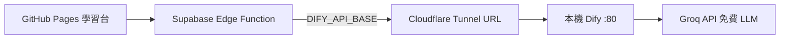

# Dify 公網連線（Supabase Edge Function）

讓 **Supabase Edge Function** 的 `POST /dify/ask` 與 GitHub Pages Step 4 能連到 Dify。
推薦路線：**本機既有 Dify Docker + Cloudflare Quick Tunnel**（免費、開發最快）。  
若需 24/7 免費 VPS，見文末「進階：Oracle Cloud」。

---

## 架構



---

## 前置

- 本機 Dify 已跑（`deploy/dify-setup.md` 或 `.\scripts\setup-dify.ps1`）
- Chat App 已發布，已有 `app-...` API Key
- 已安裝 [cloudflared](https://developers.cloudflare.com/cloudflare-one/connections/connect-networks/downloads/)（Windows MSI 或 `winget install Cloudflare.cloudflared`）

---

## Step 1 — 啟動 Tunnel（本機）

**方式 A：腳本**

```powershell
cd C:\Users\ytwei\Projects\AI-Agent-Tutorial
.\scripts\setup-dify-tunnel.ps1
```

**方式 B：手動**

```powershell
cloudflared tunnel --url http://localhost:80
```

終端機會顯示類似：

```text
https://something-random.trycloudflare.com
```

記下此網址（每次重開 tunnel **可能變**；教學可接受，正式可改 Named Tunnel）。

**保持此視窗開啟**，並確認本機 Dify 容器在跑。

---

## Step 2 — Dify 內改用 Groq（免費真實 LLM）

雲端無法用 `host.docker.internal` 連 Ollama。

1. https://console.groq.com 註冊並建立 API Key（免費）
2. Dify → **Settings** → **Model Provider** → 新增 **OpenAI-API-compatible**（或安裝對應插件）
3. 設定：

| 欄位 | 值 |
|------|-----|
| Base URL | `https://api.groq.com/openai/v1` |
| API Key | `gsk_...` |
| Model | `llama-3.3-70b-versatile` |

4. 進入 **AI-Agent-Tutorial** Chat App → 模型改選 Groq → **Publish**

---

## Step 3 — Supabase Function Secrets

Supabase Dashboard → **Edge Functions → Secrets**：

| 變數 | 範例 |
|------|------|
| `DIFY_API_BASE` | `https://something-random.trycloudflare.com/v1` |
| `DIFY_API_KEY` | `app-xxxxxxxx`（Dify 後台 API Access） |

注意：

- `DIFY_API_BASE` 結尾為 `/v1`，**不要**漏掉
- 使用 `https://` 開頭的 tunnel 網址

儲存後重新部署 `api` Function；若使用 GitHub Actions，push `supabase/functions/` 的變更即可觸發部署。

---

## Step 4 — 驗收

```powershell
Invoke-RestMethod https://<project-ref>.supabase.co/functions/v1/api/health
```

預期：`dify_configured: true`，`llm_provider: gemini`

瀏覽器：

1. GitHub Pages 學習台
2. **Step 4** 提問「REST 的 GET 是做什麼？」  
3. 應回傳自然語句（非 Mock），非 502

Swagger：`POST /dify/ask`

---

## 常見問題

| 症狀 | 解法 |
|------|------|
| `dify_configured: false` | Supabase Function Secrets 未設 `DIFY_API_KEY` 或 Function 尚未重新部署 |
| 502 Dify request failed | Tunnel 關了、Dify 容器停了、或 `DIFY_API_BASE` 錯 |
| 401 | API Key 錯或未 Publish |
| Tunnel URL 變了 | 更新 Supabase `DIFY_API_BASE` secret 並重新部署 |
| 本機 OK、線上失敗 | 確認 tunnel 與 Dify 同時運行 |

---

## 進階：Oracle Cloud Always Free（24/7）

若不想依賴本機開機 + tunnel：

1. 建立 Oracle Cloud Always Free ARM VM（約 24GB RAM）
2. 安裝 Docker，clone `langgenius/dify`，`docker compose up -d`
3. 開放 80/443 安全群組，使用 VM 公網 IP 作為 `DIFY_API_BASE`
4. Dify 內同樣接 Groq

此路線設定較長，適合第二階段；教學第一週建議先用 Tunnel。

---

## 相關文件

- 本機 Dify：`deploy/dify-setup.md`
- Edge Function LLM：`deploy/free-llm-cloud.md`
- 進度：`deploy/PROGRESS.md`
